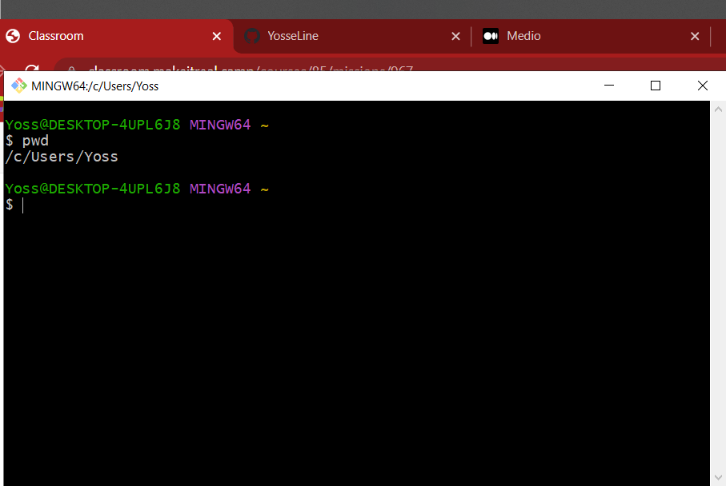
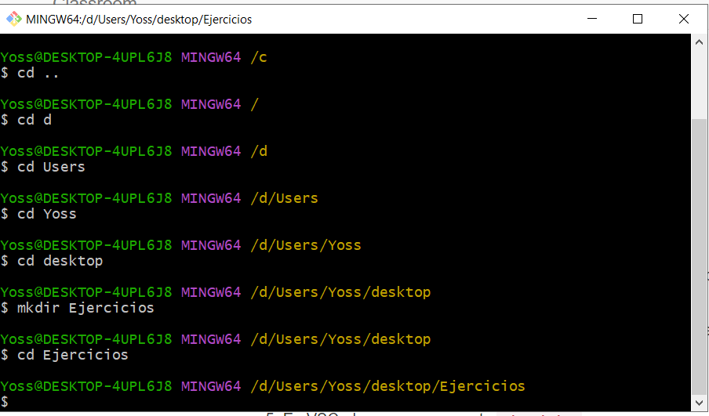
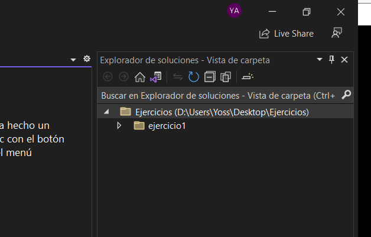
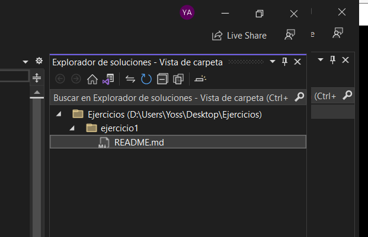
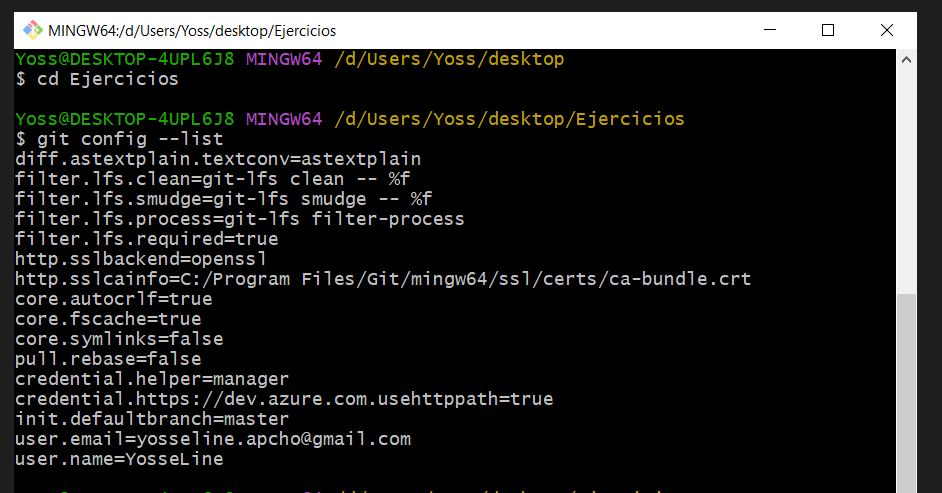
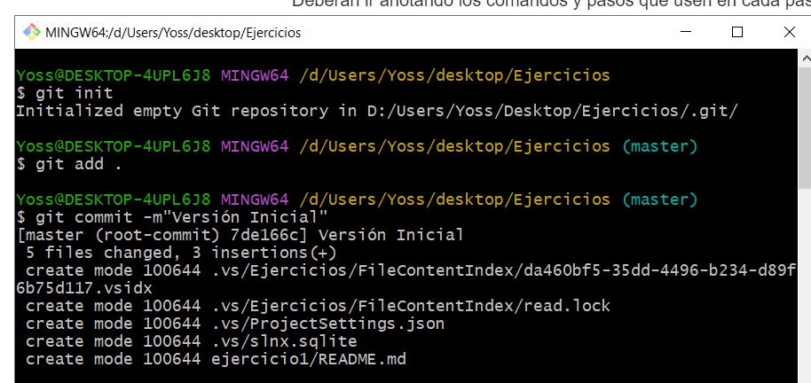
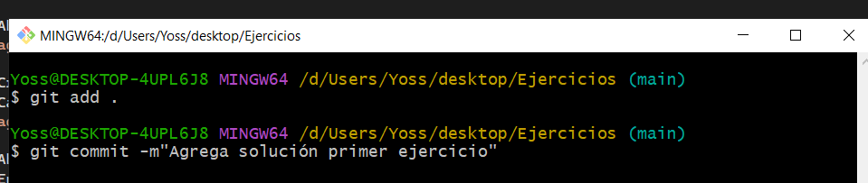

#S2 - GIT (Ejercicio 1)

1. Abrir la consola e imprimir la ubicación actual.

2. Crear una carpeta llamada ejercicios en el escritorio desde la consola, si no estas en la ruta del escritorio, muevete a ella.
3. Cambiar la ubicación a la nueva carpeta que crearon.

4. Abrir la carpeta con VSCode.
5. En VSCode crear una carpeta ejercicio1.

6. Crear un archivo llamado README.md (vacío) dentro de la carpeta ejercicio1.

7. Configurar nombre e email globalmente en git.
(Como ya se configuró anteriormente, se procede a mostrar la lista de configuración)

8. Inicializar el repositorio de git desde la línea de comandos desde la carpeta ejercicios.
9. Crear un primer commit con el mensaje “Versión Inicial”.

10. Agregar al README.md los comandos que ejecutaron en cada paso.
11. Crear un nuevo commit con el mensaje “Agrega solución primer ejercicio”

